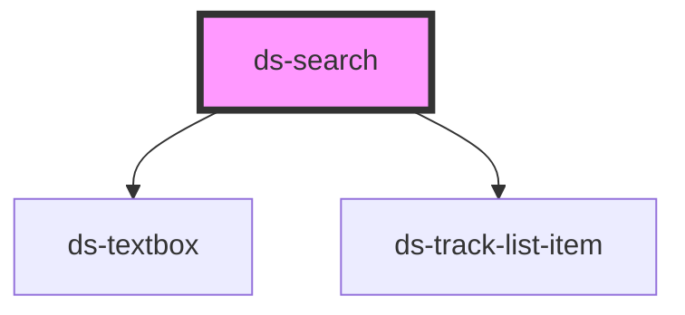

# ds-textbox

<!-- Auto Generated Below -->

## Properties

| Property | Attribute | Description | Type     | Default     |
| -------- | --------- | ----------- | -------- | ----------- |
| `value`  | `value`   |             | `string` | `undefined` |

## Events

| Event                | Description | Type                  |
| -------------------- | ----------- | --------------------- |
| `changed`            |             | `CustomEvent<string>` |
| `changeTrackRequest` |             | `CustomEvent<any>`    |

## Dependencies

### Depends on

- [ds-textbox](../ds-textbox)
- [ds-track-list-item](../ds-track-list-item)

### Graph

----------------------------------------------

*Built with [StencilJS](https://stenciljs.com/)*
