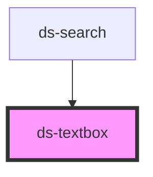

# ds-textbox

<!-- Auto Generated Below -->

## Properties

| Property      | Attribute     | Description | Type      | Default     |
| ------------- | ------------- | ----------- | --------- | ----------- |
| `color`       | `color`       |             | `string`  | `undefined` |
| `label`       | `label`       |             | `string`  | `undefined` |
| `name`        | `name`        |             | `string`  | `undefined` |
| `placeholder` | `placeholder` |             | `string`  | `undefined` |
| `type`        | `type`        |             | `string`  | `undefined` |
| `valid`       | `valid`       |             | `boolean` | `undefined` |
| `value`       | `value`       |             | `string`  | `undefined` |

## Events

| Event     | Description | Type                  |
| --------- | ----------- | --------------------- |
| `changed` |             | `CustomEvent<string>` |

## Dependencies

### Used by

 - [ds-search](../ds-search)

### Graph

----------------------------------------------

*Built with [StencilJS](https://stenciljs.com/)*
