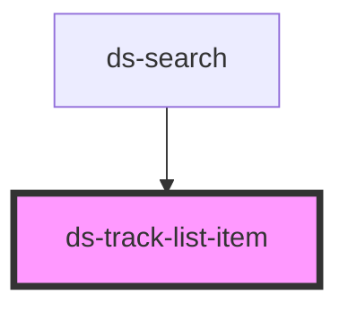

# ds-card

<!-- Auto Generated Below -->

## Properties

| Property    | Attribute    | Description | Type     | Default     |
| ----------- | ------------ | ----------- | -------- | ----------- |
| `eventName` | `event-name` |             | `string` | `undefined` |
| `track`     | --           |             | `Track`  | `undefined` |

## Events

| Event             | Description | Type               |
| ----------------- | ----------- | ------------------ |
| `listItemClicked` |             | `CustomEvent<any>` |

## Dependencies

### Used by

 - [ds-search](../ds-search)

### Graph

----------------------------------------------

*Built with [StencilJS](https://stenciljs.com/)*
